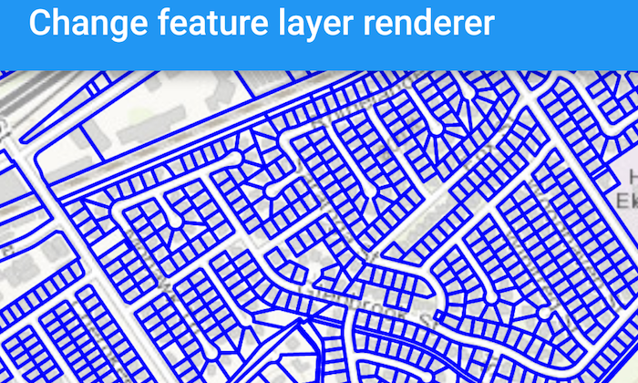

# Change feature layer renderer
This sample demonstrates how to override and reset a renderer of a feature layer. Use the buttons in the bottom toolbar to override or reset the renderer.



## How it works
Feature layer has a property called renderer you can set to override the renderer. Feature layer also provides a method called reset renderer to reset the renderer back to the original one that is defined in its service definition.

## Developer Pattern

### Java
```java
private void overrideRenderer() {
    // create a new simple renderer for the line feature layer
    SimpleLineSymbol lineSymbol = new SimpleLineSymbol(SimpleLineSymbol.Style.SOLID, Color.rgb(0, 0, 255), 2);
    SimpleRenderer simpleRenderer = new SimpleRenderer(lineSymbol);

    // override the current renderer with the new renderer defined above
    mFeatureLayer.setRenderer(simpleRenderer);
}

private void resetRenderer() {
    // reset the renderer back to the definition from the source (feature service) using the reset renderer method
    mFeatureLayer.resetRenderer();

    }
```

### Kotlin
```kotlin
private fun overrideRenderer() {
    // create a new simple renderer for the line feature layer
    val lineSymbol = SimpleLineSymbol(SimpleLineSymbol.Style.SOLID, Color.rgb(0, 0, 255), 2f)
    val simpleRenderer = SimpleRenderer(lineSymbol)

    // override the current renderer with the new renderer defined above
    mFeatureLayer!!.renderer = simpleRenderer
}

private fun resetRenderer() {
    // reset the renderer back to the definition from the source (feature service) using the reset renderer method
    mFeatureLayer!!.resetRenderer()
}
```