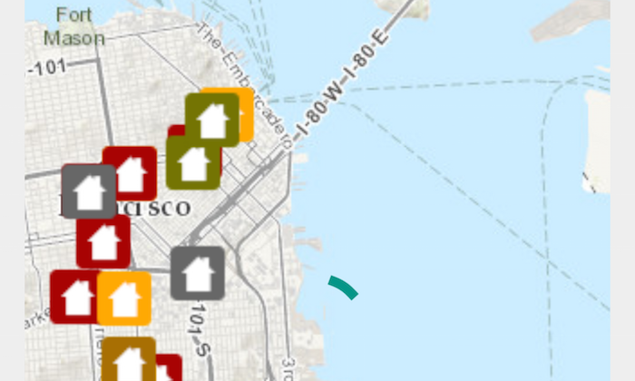

# Display Drawing Status



The **Display Drawing Status** app shows how to use the ```DrawStatus``` value representing drawing state of the ```MapView``` to display an Android ```ProgressBar``` while the map is loading.

## Features
* ArcGISMap
* MapView
* ServiceFeatureTable
* DrawStatus
* DrawStatusChangedEvent
* DrawStatusChangedListener

## Developer Pattern
The listener interface for receiving `DrawStatus` changed events from the `MapView`:

### Java
```java
mMapView.addDrawStatusChangedListener(new DrawStatusChangedListener() {
    @Override
    public void drawStatusChanged(DrawStatusChangedEvent drawStatusChangedEvent) {
        if(drawStatusChangedEvent.getDrawStatus() == DrawStatus.IN_PROGRESS){
            progressBar.setVisibility(View.VISIBLE);
            Log.d("drawStatusChanged", "spinner visible");
        }else if (drawStatusChangedEvent.getDrawStatus() == DrawStatus.COMPLETED){
            progressBar.setVisibility(View.INVISIBLE);
        }
    }
});
```

### Kotlin
```kotlin
//[DocRef: Name=Monitor map drawing, Category=Work with maps, Topic=Display a map]
mMapView!!.addDrawStatusChangedListener { drawStatusChangedEvent ->
    if (drawStatusChangedEvent.drawStatus == DrawStatus.IN_PROGRESS) {
        progressBar.visibility = View.VISIBLE
        Log.d("drawStatusChanged", "spinner visible")
    } else if (drawStatusChangedEvent.drawStatus == DrawStatus.COMPLETED) {
        progressBar.visibility = View.INVISIBLE
    }
}
//[DocRef: END]
```