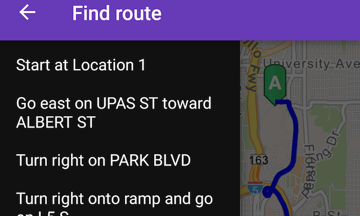

# Find route
This sample demonstrates how to get a route between two locations



#How to use the sample
For simplicity the sample comes with Source and Destination stops. You can click on the Navigation  Floating Action Button to get a route between the stops. Once a route is generated, the `DrawerLayout` is unlocked and you can view the direction maneuver as a list.

#Features

* RouteTask
* RouteResult
* RouteParameters
* Route
* DirectionManeuver

# How it works

The sample creates a ```RouteTask``` from the and uses default ```RouteParameters```from the ```RouteTask``` service to set up the **stops**. In order to get detailed driving directions, ```setReturnDirections``` is set true in the parameters. ```RouteTask.solveAsync``` is used to solve for route. The ```RouteResult``` is then used to create the route graphics and ```getDirectionManeuvers()``` on route result returns step-by-step direction list which is populated in the `ListView`

## Java
```java
                // create RouteTask instance
                mRouteTask = new RouteTask(getString(R.string.routing_service));

                final ListenableFuture<RouteParameters> listenableFuture = mRouteTask.generateDefaultParametersAsync();
                listenableFuture.addDoneListener(new Runnable() {
                    @Override
                    public void run() {
                        try {
                            if (listenableFuture.isDone()) {
                                int i = 0;
                                mRouteParams = listenableFuture.get();

                                // get List of Stops
                                List routeStops = mRouteParams.getStops();
                                // set return directions as true to return turn-by-turn directions in the result of getDirectionManeuvers().
                                mRouteParams.setReturnDirections(true);

                                // add your stops to it
                                routeStops.add(new Stop(new Point(-13041171.537945, 3860988.271378, SpatialReferences.getWebMercator())));
                                routeStops.add(new Stop(new Point(-13041693.562570, 3856006.859684, SpatialReferences.getWebMercator())));

                                // solve
                                RouteResult result = mRouteTask.solveAsync(mRouteParams).get();
                                List routes = result.getRoutes();
                                mRoute = (Route) routes.get(0);
                                // create a route graphic
                                Graphic routeGraphic = new Graphic(mRoute.getRouteGeometry(), route);
                                // add route graphic to the map
                                graphicsOverlay.getGraphics().add(routeGraphic);
                                // get directions
                                // NOTE: to get turn-by-turn directions Route Parameters should set returnDirection flag as true
                                List<DirectionManeuver> directions = mRoute.getDirectionManeuvers();

                                String[] directionsArray = new String[directions.size()];

                                for (DirectionManeuver dm : directions) {
                                    directionsArray[i++] = dm.getDirectionText();
                                }

                                // Set the adapter for the list view
                                mDrawerList.setAdapter(new ArrayAdapter<>(getApplicationContext(),
                                        R.layout.drawer_layout_text, directionsArray));

                                if (mProgressDialog.isShowing()) {
                                    mProgressDialog.dismiss();
                                }

                            }
                        } catch (Exception e) {
                            Log.e(TAG, e.getMessage());
                        }
                    }
                });
```

## Kotlin
```kotlin
            // create RouteTask instance
            mRouteTask = RouteTask(getString(R.string.routing_service))

            val listenableFuture = mRouteTask!!.createDefaultParametersAsync()
            listenableFuture.addDoneListener {
                try {
                    if (listenableFuture.isDone) {
                        var i = 0
                        mRouteParams = listenableFuture.get()

                        // get List of Stops
                        val routeStops = mRouteParams!!.stops
                        // set return directions as true to return turn-by-turn directions in the result of getDirectionManeuvers().
                        mRouteParams!!.isReturnDirections = true

                        // add your stops to it 32.7254716,-117.1508181 32.7076359,-117.1592837 -117.15557279683529
                        //-13041171, 3860988, SpatialReference(3857) -13041693, 3856006, SpatialReference(3857)
                        routeStops.add(Stop(Point(-117.15083257944445, 32.741123367963446, SpatialReferences.getWgs84())))
                        routeStops.add(Stop(Point(-117.15557279683529, 32.703360305883045, SpatialReferences.getWgs84())))

                        // solve
                        val result = mRouteTask!!.solveRouteAsync(mRouteParams!!).get()
                        val routes = result.routes
                        mRoute = routes[0] as Route
                        // create a mRouteSymbol graphic
                        val routeGraphic = Graphic(mRoute!!.routeGeometry, mRouteSymbol!!)
                        // add mRouteSymbol graphic to the map
                        mGraphicsOverlay!!.graphics.add(routeGraphic)
                        // get directions
                        // NOTE: to get turn-by-turn directions Route Parameters should set returnDirection flag as true
                        val directions = mRoute!!.directionManeuvers

                        val directionsArray = arrayOfNulls<String>(directions.size)

                        for (dm in directions) {
                            directionsArray[i++] = dm.directionText
                        }
                        Log.d(TAG, directions[0].geometry.extent.xMin.toString() + "")
                        Log.d(TAG, directions[0].geometry.extent.yMin.toString() + "")

                        // Set the adapter for the list view
                        mDrawerList!!.adapter = ArrayAdapter<String>(applicationContext,
                                R.layout.find_route_drawer_layout_text, directionsArray)

                        if (mProgressDialog!!.isShowing) {
                            mProgressDialog!!.dismiss()
                        }
                        mDrawerList!!.onItemClickListener = AdapterView.OnItemClickListener { parent, view, position, id ->
                            if (mGraphicsOverlay!!.graphics.size > 3) {
                                mGraphicsOverlay!!.graphics.removeAt(mGraphicsOverlay!!.graphics.size - 1)
                            }
                            mDrawerLayout!!.closeDrawers()
                            val dm = directions[position]
                            val gm = dm.geometry
                            val vp = Viewpoint(gm.extent, 20.0)
                            mMapView!!.setViewpointAsync(vp, 3f)
                            val selectedRouteSymbol = SimpleLineSymbol(SimpleLineSymbol.Style.SOLID, Color.GREEN, 5f)
                            val selectedRouteGraphic = Graphic(directions[position].geometry, selectedRouteSymbol)
                            mGraphicsOverlay!!.graphics.add(selectedRouteGraphic)
                        }

                    }
                } catch (e: Exception) {
                    Log.e(TAG, e.message)
                }
            }
```