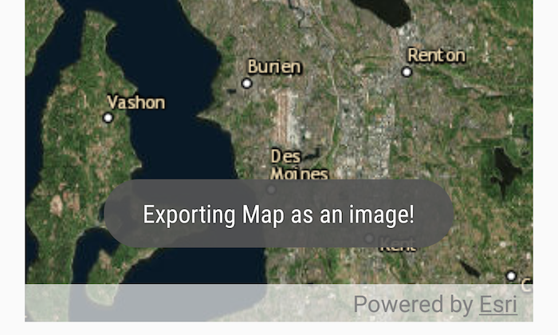

# Take Screenshot
The purpose of this sample is to demonstrate how to export the map as an image file. `MapView.exportImageAsync` exports the map to **Bitmap** format which can be saved in any image file format.



## Features
* ArcGISMap
* MapView
* ExportImageAsync

## Developer Pattern

### Java
```java
// export the image from the mMapView
final ListenableFuture<Bitmap> export = mMapView.exportImageAsync();
export.addDoneListener(new Runnable() {
    @Override
    public void run() {
        try {
            Bitmap currentMapImage = export.get();
            // play the camera shutter sound
            MediaActionSound sound = new MediaActionSound();
            sound.play(MediaActionSound.SHUTTER_CLICK);
            Log.d(TAG,"Captured the image!!");
            // save the exported bitmap to an image file
            SaveImageTask saveImageTask = new SaveImageTask();
            saveImageTask.execute(currentMapImage);
        } catch (Exception e) {
            Log.d(TAG, "Fail to export map image: " + e.getMessage());
        }
    }
});
}
```

### Kotlin
```kotlin
        // export the image from the mMapView
        val export = mMapView!!.exportImageAsync()
        export.addDoneListener {
            try {
                val currentMapImage = export.get()
                // play the camera shutter sound
                val sound = MediaActionSound()
                sound.play(MediaActionSound.SHUTTER_CLICK)
                Log.d(TAG, "Captured the image!!")
                // save the exported bitmap to an image file
                val saveImageTask = SaveImageTask()
                saveImageTask.execute(currentMapImage)
            } catch (e: Exception) {
                Toast.makeText(applicationContext, resources.getString(R.string.map_export_failure) + e.message, Toast.LENGTH_SHORT).show()
                Log.e(TAG, resources.getString(R.string.map_export_failure) + e.message)
            }
        }
```